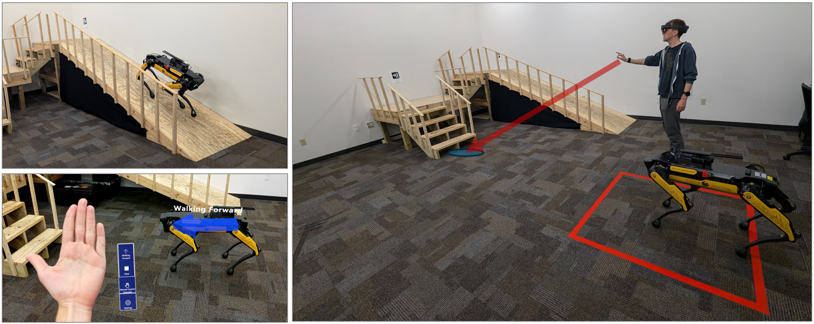

# Evaluating the Effectiveness of Augmented Reality Interfaces for Quadrupedal Robot Motion Control

This repository is the official implementation of [**Evaluating the Effectiveness of Augmented Reality Interfaces for Quadrupedal Robot Motion Control**](). 

