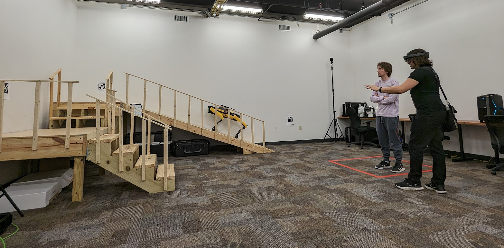
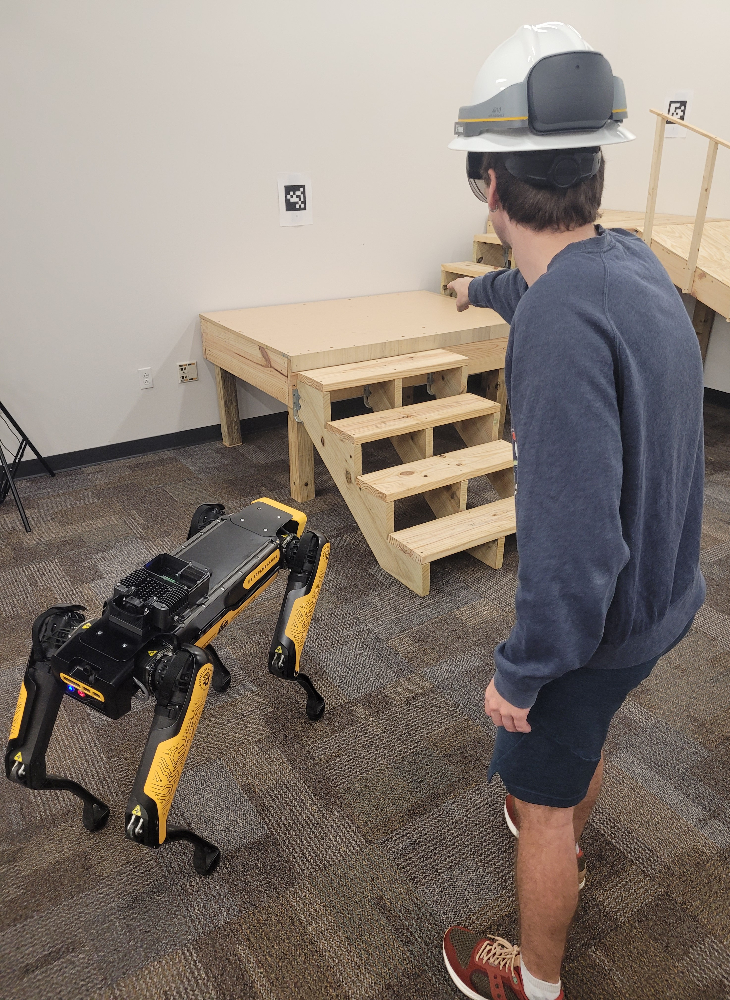
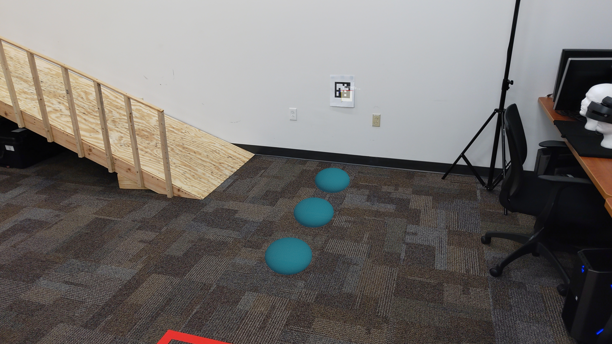

# Evaluating the Effectiveness of Augmented Reality Interfaces for Quadrupedal Robot Motion Control

This repository is the official implementation of [**Evaluating the Effectiveness of Augmented Reality Interfaces for Quadrupedal Robot Motion Control**](). 

This study examines how Augmented Reality (AR) interfaces affect navigation control of the [**Boston Dynamics Spot**](https://bostondynamics.com/products/spot/) quadrupedal robot UCF [**TapeMeasure**](https://www.instagram.com/ucf.tapemeasure/). Testing with 33 non-experts and two experts showed that AR provided smoother robot movement and similar usability and trust compared to tablet controls, despite longer task times. The findings highlight AR’s potential to make advanced robotic systems more accessible and trusted by a wider range of users. This repository allows researchers to replicate the environment for our study and help aid their own studies that leverage quadrupedal robotic platforms.

## Spot Digital Twin

In this mode, a virtual **Spot** model is augmented directly over the real *Spot* robot when the *HoloLens 2* is connected to Spot’s network Wi-Fi. This creates a synchronized **digital twin** that mirrors Spot’s movements in real time, allowing users to see both the physical robot and its digital counterpart aligned in the same space. The virtual twin provides enhanced situational awareness and helps visualize movement and orientation during operation.

|  |  |
|:------------------------------------------:|:---------------------------------------------:|
| Digital/Physical Spot                             | Network UI                              |
|  |  |
| Motion View                            | Hover View                            |

With the digital twin view, Spot’s motion path can be plotted in Unity as real-time movement data is streamed back to a control computer. As the physical robot moves, the virtual Spot’s joints animate in sync, replicating its exact posture and gait. An orange path traces the movement of the root node in space, providing a continuous visual history of the robot’s trajectory for analysis and review.

|  |  |
|:------------------------------------------:|:--------------------------------------------

# Spot Control UI

#### ROS2 Interface

The ROS2 controls provide a standardized interface for sending commands to Spot and receiving sensor data. Through this interface, the HoloLens or control computer can manage robot movement, joint positions, and operational states, enabling precise and coordinated control during AR-assisted navigation and experiments.

To connect the HoloLens to the ROS2 interface, it must first be connected to the Spot robot’s Wi-Fi network. The ROS interface menu displays the IP address and port required for the connection, and its status indicator changes from red to green when the link is successfully established after the user hits the connect button. Four box indicators at the top of the menu show each stage of the connection process, making it easy to identify and troubleshoot any specific step that may be causing networking issues.

#### Spot HoloLens 2 UI Control

This study used a Microsoft HoloLens 2 to control Spot.

When the user raises their left hand, a set of buttons appears, allowing them to **start, stop, or change the robot’s motion direction**. Additionally, a **settings button** provides access to more advanced features, such as configuring the ROS2 controller and other system options.

Users navigate Spot by using a **ray cast** and **pinch gesture** to indicate their desired target location. Once the robot begins moving, a **blue arrow** appears over Spot to show its current direction, while a **red dot** on the floor marks the target destination. This visual feedback helps the user monitor both the intended path and the robot’s orientation during navigation.

|  |  |
|:------------------------------------------:|:---------------------------------------------:|

AR indicators are overlaid onto the physical environment by the HoloLens, providing real-time visual cues such as the **ray cast pointer** (white dash line) and the **directional target** (red circle). This augmentation allows users to see exactly where Spot will move and interact with the environment, enhancing spatial awareness and precision during navigation.

|  |  |
|:------------------------------------------:|:---------------------------------------------:|

#### GO and STOP Controls

The Stop-and-Go AR interface uses clear visual and audio cues to indicate Spot’s operational state. When in **GO** mode, a blue arrow is shown over Spot and dot appear on the left-hand menu along with an audio prompt. When in **STOP** mode, a red arrow is shown over Spot and dot are displayed on the user’s hand, ensuring the human controller can quickly recognize the robot’s current state. Additionally, the arrow and text prompt shows which direct Spot is moving, for example * Walking Foward*.

|  |  |
|:------------------------------------------:|:---------------------------------------------:|
| **GO** UI Indicator                             | **STOP** UI Indicator                              |

#### Spot Tablet UI Control

The Spot tablet UI from Boston Dynamics provides a **touchscreen interface** for controlling the robot. It includes two main joystick controllers: the **left joystick** controls Spot’s rotation, while the **right joystick** manages motion direction. 

The tablet also offers more [detailed controls](https://support.bostondynamics.com/s/article/Spot-App-Menus-and-General-Controls-49952), such as walk speed, operational modes, camera views, and additional options in the [Boston Dynamics app](https://support.bostondynamics.com/s/spot/downloads), but these features were not utilized in the study.

## HoloLens 2 Training

The `Spot-AR-main` folder contains the Unity projects used for the AR control study, including the **participant HoloLens 2 training module**. In this module, participants see three virtual blue balls in the AR environment. Using a **ray cast pointer**, they must hover over each ball and perform a **pinch gesture** to make it disappear. This exercise allows participants to practice the core interaction mechanics—target selection and gesture input—before moving on to the main navigation tasks. The training also provides an opportunity to get comfortable with controlling Spot’s movement in AR, ensuring participants are ready for the full study.

|  |  |  |
|-----------------------------|-----------------------------|-----------------------------|

## Tablet Training

The `Spot-TabletTraining` folder contains a Unity project designed to help users understand and practice with the two major joystick controls for Spot:

- **Left joystick** – Controls Spot’s rotation (turning left or right).
- **Right joystick** – Controls Spot’s movement (forward, backward, and sideways).

#### Training Objective

The goal of the training is to **navigate to the four blue boxes displayed on screen** as quickly and precisely as possible. This exercise develops both accuracy and speed in operating Spot’s controls.

#### Project Details

- **Unity Version:** 2021.3.5  (*Works with upgrading to ver 6+*)
- **Main Scene:** `SampleScene.unity`  

To launch the training, open: `SampleScene.unity` and start the scene. This project is desigend for tablet touch screen controls, but the left and right mouse buttons work to simulate the robot controls.

|  |  |
|:------------------------------------------:|:---------------------------------------------:|
| Left Joystick                              | Right Joystick                               |
|  |  |
| Navigation View                            | Target Blue Boxes                            |

