# Collecting Data from the Garmin watches

[NOTE: This READme was adapted from SENSEable Design Lab Minerva Project and not fully updated to this project's specifics.]

Python 3 API wrapper for Garmin Connect.
1. Upload raw watch data
2. Process data with Python

## Uploading the data from the Garmin fenix 6x watches

The **raw** data on the watches are usually available at the following location (**Activity**): `fenix 6x Pro > Primary > GARMIN > Activity` 
I make sure **Garmin Express** is **Closed** and open the folder, copying over the raw session files to preserve them.
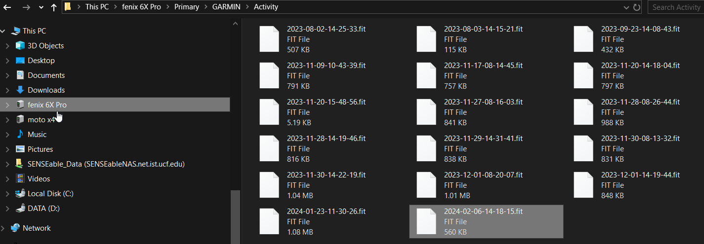

I make a `data_raw repository` per watch just to be able to go back to the raw fit files if something happens with the upload and moving the data through the Garmin Connect Cloud database.
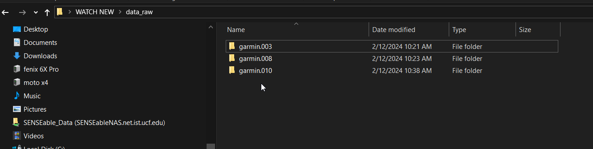

One this is uploaded I go to the `Garmin Express` App and open it.
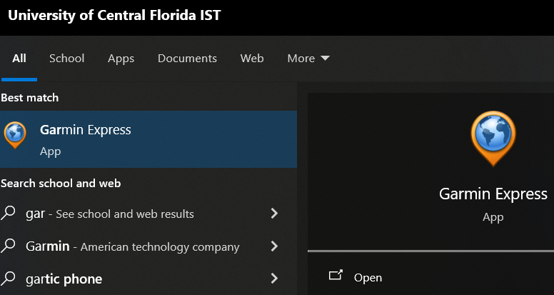

You should set up the watches 1x time (then they will always be loaded) matching the watches with the serial number to the right accounts and partipant ids

| Account                                           | Serial    | PID |
| ------------------------------------------------- | --------- | --- |
| UCF.Garmin.010                                    | 634846421 | 01  |
| UCF.Garmin.003                                    | 634497954 | 02  |
| UCF.Garmin.008                                    | 634634509 | 03  |

you then just have to click on the watch so that it is synchronized

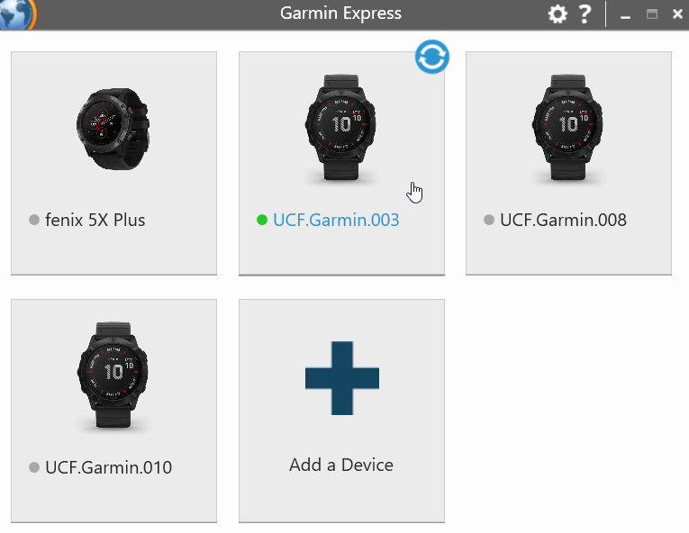

If you  are prompted  to add wifi ,  **do not add** it and ignore the prompt
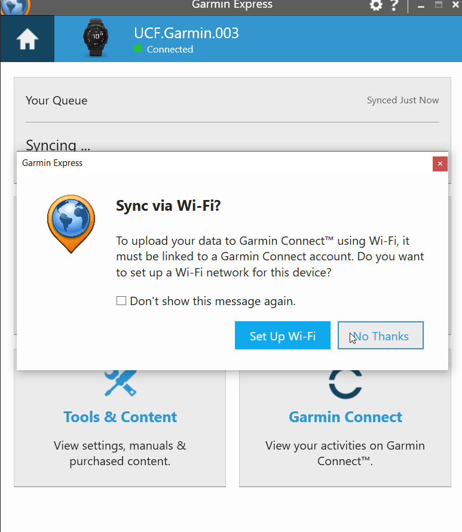

It should show that the sync was complete
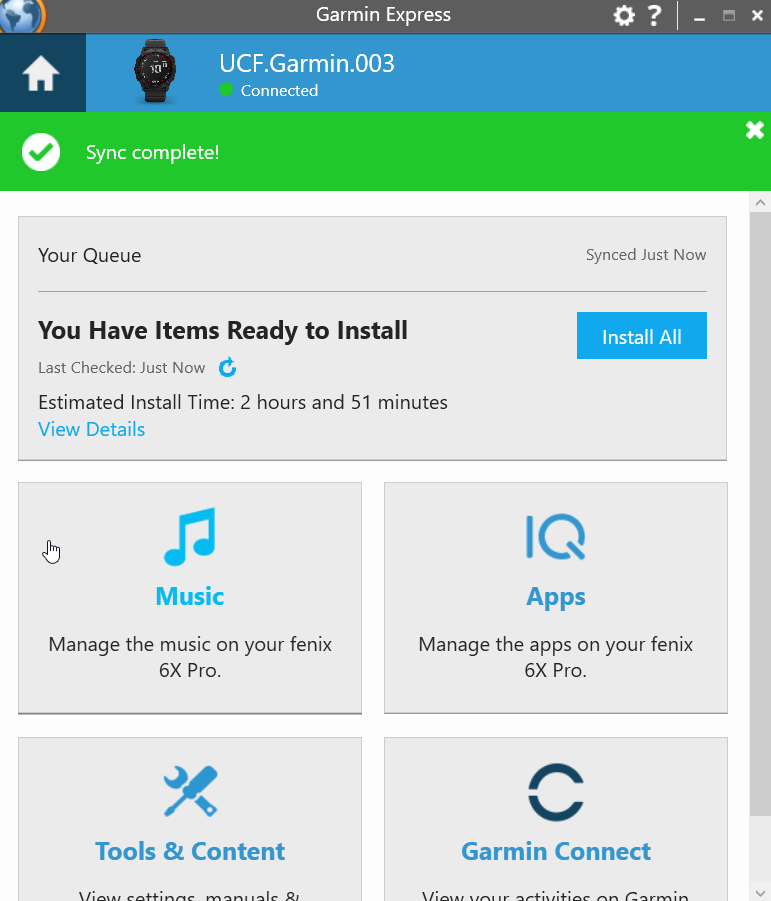

you can then quit by making sure you click quit in the lower right panel
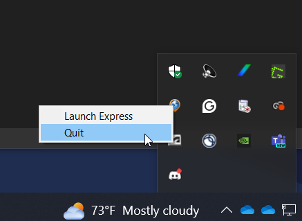

You can check if the activity for the session uploaded at [**Garmin Connect**](https://connect.garmin.com/) and looking for your activity:
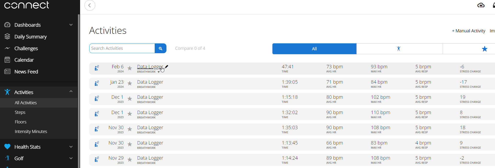

## Python Code for grabbing the data from the Garmin Connect Cloud

The directory contains the following files:
* capture_dates.ini   - Date you want to pull data for (or connected range of dates)
* credentials_test.ini  - which has the information for the 3 watch accounts we are using
* python-garminconnect-master.zip  - zip of the [**Python GarminConnect**](https://github.com/cyberjunky/python-garminconnect) source code as of Feb 2024
* garminconnect - directory of this library  **DO NOT** use the one from PyPi
* create-data-folders.py  - run first to create the relevant folder structure
* grab.py - grabs the data and organizes it into folders

#### Do NOT install the garminconnect library from PyPi
For whatever reason this is not being maintained ; you will have to `pip3 uninstall garminconnect` if its on your computer. I have been pulling the code directly from source or install the pip directly from GitHub source directly found here: [**https://github.com/cyberjunky/python-garminconnect**](https://github.com/cyberjunky/python-garminconnect)

#### Becareful when modifying or pulling data
Garmin rate limits you, so you can run into the senario it will generate errors for pulling data to quickly from their servers and temp block your IP for a while - only way around this is to wait, or use another computer.

### Steps to run to pull data for experiment sessions
1. Determine the dates you want to pull for and set them in the  `capture_dates.ini` 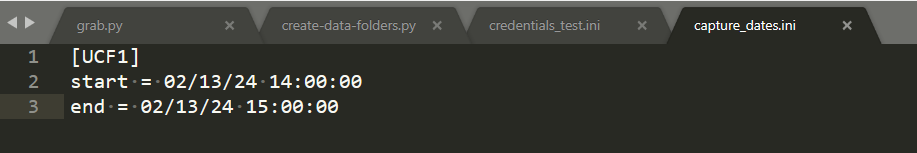
2. The 3 experiment watches are already set in credentials_test.ini  but modify them if you need more or less there. 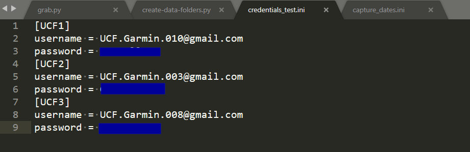
3. Run `python3 create-data-folders.py` this will create the nice folder structure in a data folder for you with the watches and session dates. 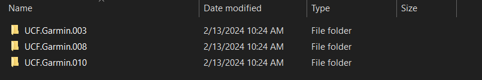 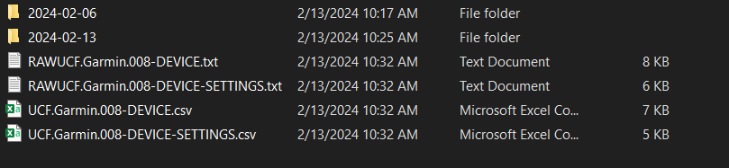
4. Run `python3 grab.py` this will pull the underlying watch data 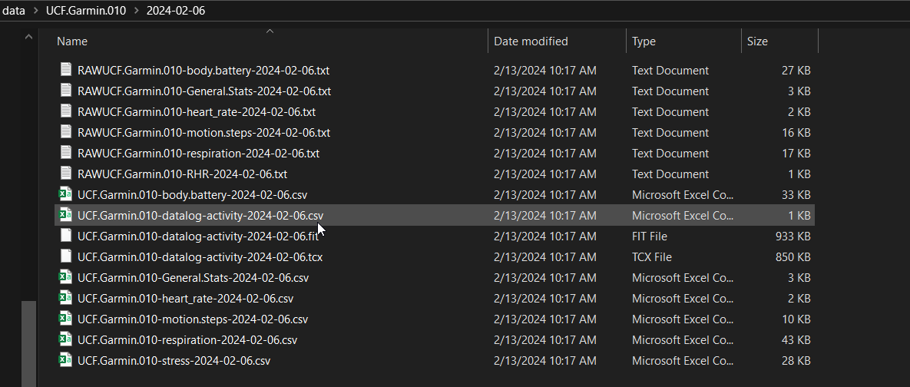 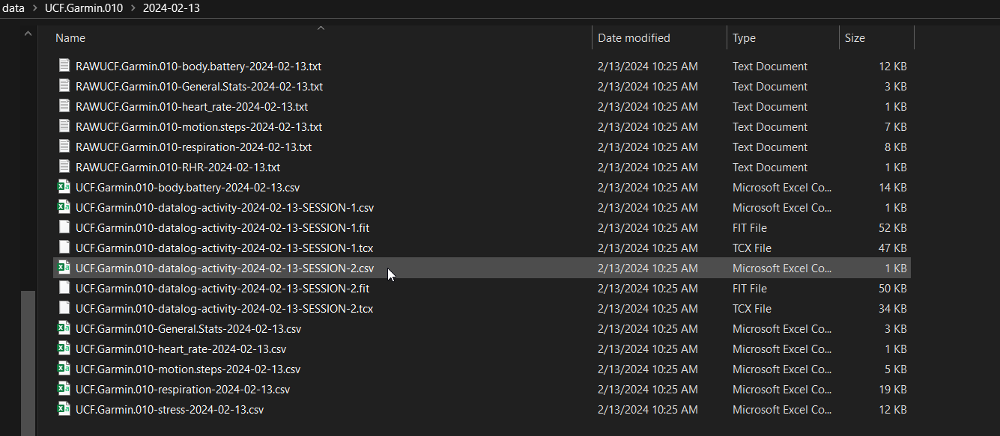
